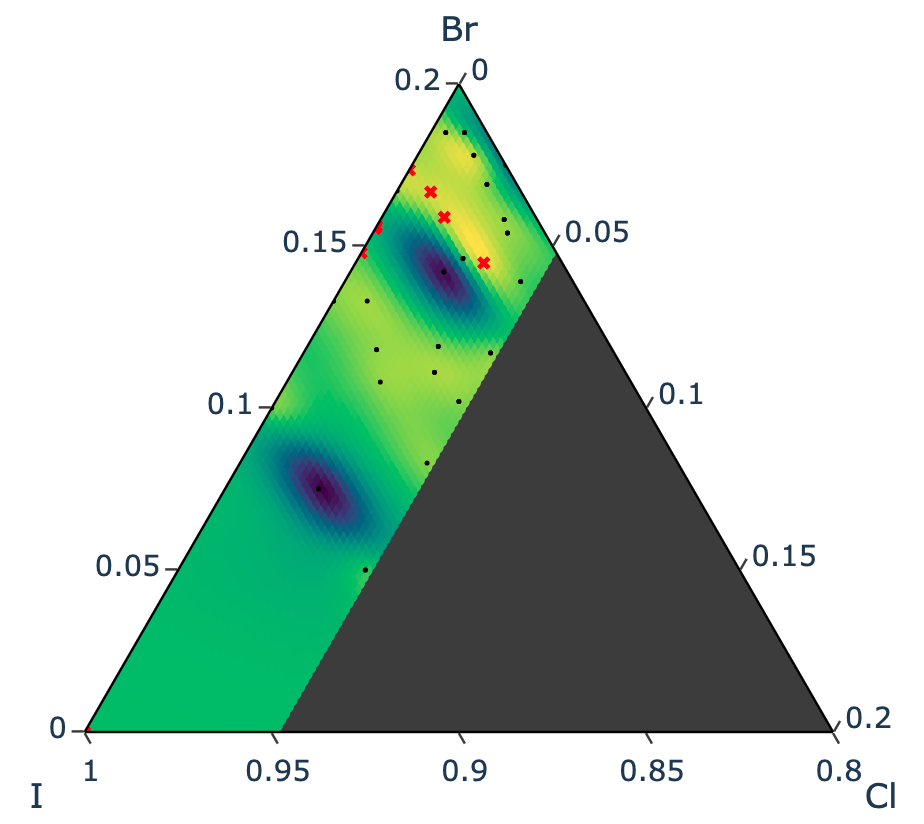
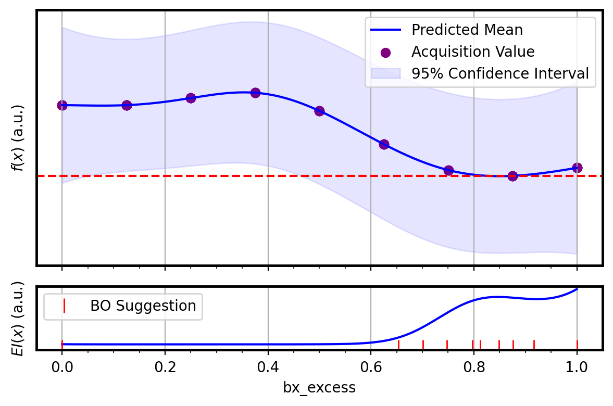

# BO-PV
Bayesian Optimization for Metal Halide Perovskites

## Motivation

This repo is dedicated to the pipeline design and operation of ax.dev for multiobjective (or single) BO with materials discovery in mind. Example use case is to optimize the MHP with a specific bandgap in mind. 

### Demo of BO Results

Fitted response surface in background of a scalarized objective (multipiple objectives combined with a weight). Priors are black circles, with the suggested next batch of n samples in red X symbol. 

### Demo of qNegIntegratedPosteriorVariance + qNoisyExpectedImprovement (50:50) on a single objective optimization in a 1D parameter space

### Demo of qUCB with Beta = 0.5 on a single on a single objective optimization in a 1D parameter space

